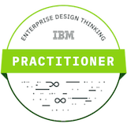
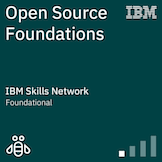
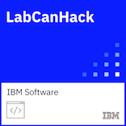
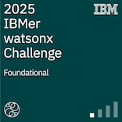

# Hi there 👋 I'm Jyothish M B

## 🚀 About Me

- 💼 Senior Software Engineer with a strong background in technical leadership, architecture, and enterprise application development
- 💻 13 Years of Software Development Experience
- 🏗️ Passionate about building scalable enterprise applications
- ☁️ Interested in Cloud, Architecture, DevOps, and Modern Development Practices
- 🚴 Cycling enthusiast focused on discipline, endurance, and continuous improvement

---

## 💼 Professional Experience

| Area | Experience |
|--------|-----------|
| Software Development | 13 Years |
| .NET Development | 12 Years |
| C# | 12 Years |
| VB.NET | 2 Years |
| SQL Server | 13 Years |
| REST APIs | 10+ Years |
| Cloud Technologies | 6 Years |
| System Architecture | 3 Years |
| DevOps & CI/CD | 5 Years |

---

## 🛠️ Languages & Technologies

### Programming Languages

  

### Frameworks & Technologies

  

### Tools

  

---

## 📊 GitHub Stats

---

## 🏆 Certifications & Badges

### Credly Badges

---

## 🌱 Currently Learning

- Software Architecture
- Cloud Native Development
- Rust
- Kubernetes
- AI-Assisted Development

---

## 📫 Connect With Me

📧 jyothishblogger@gmail.com

---

### "Building reliable software one commit at a time."
